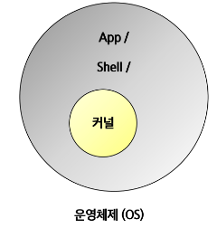

# 리눅스 쉘 프로그래밍

- 리눅스

    - 서버
    - 임베디드 OS 시장 지배

임베디드 OS가 무엇인가요 ?

- 임베디드 OS와 펌웨어 차이점은 무엇인가요 ?

    - 펌웨어 : 일련의 하드웨어를 컨트롤하는 로직. OS가 있을 수도, 없을 수도 있음

        - 임베디드 OS의 상위 요소

        - ex) 버스카드 태깅 장치

    임베디드 OS : 하드웨어 컨트롤 + 상황에 맞게 동시에 여러 작업을 처리할 수 있는 OS

리눅스 공부란?

**리눅스를 윈도우처럼 편안하게 OS를 다룰 수 있는 것**

- 윈도우에서 하는 일
  - 파일 관리, 저장, 문서 편집
  - 프로그램 추가 삭제
  - VS로 프로그래밍
  - 시스템 관리

- 리눅스 공부의 시작 : <U>윈도우에서 할 줄 아는 일을 리눅스에서 할 줄 아는 것</U>

#### Linux는 OS가 아닌 커널이다.



OS : 커널(리눅스) + shell + app
window : 커널 + shell + app

커널 : 알맹이

리눅스 베포판 : **우분투** / Cent OS / 구름 / 레드햇 / 데비안

-> 다양한 베포판 존재

#### 우분투

  - 무료
  - 리눅스 배포판 중 가장 널리 쓰이는 배포판
  - 영국 캐노니컬에서 유지보수 중


리눅스는 어디에 쓸까 ?

- 임베디드 OS
  - 범용성이 목적이 아님
  - 프로젝트 단위로 만들어진 OS
  - 커스터마이징 필요
  - 무료 오픈소스
  - 임베디드 운영체제는 Non-OS / RTOS / Linux 등이 사용됨

목표 : 

1. 리눅스 환경 익숙해지기
2. CLI 환경에서 vi / gcc / make / shell 자동화 스크립트 만들기

그다음 .. 시스템 네트워크 커널 만들기

## 리눅스 패키지 관리 시스템

- 빌드 완료된 패키지 / 소스코드 패키지로 제공

  - 만약 빌드 완료된 바이너리 패키지라면 -> 그대로 사용 가능

  - 만약 소스코드 패키지를 받았다면 -> 빌드 후 사용

! 대부분의 환경은 CLI 환경에서 압축파일 관리법, 소스코드 빌드 이후 실행 방식을 따른다.

### 대표적인 리눅스 패키지 관리 시스템

1. **APT(CLI)**

    - 바이너리 형태로 배포
    - 소스코드 형태로 배포

2. 우분투 소프트웨어(GUI)

    - 바이너리 형태로 배포

#### 리눅스에서 불편한점

  - 패키지 설치 도구끼리 독립적으로 관리한다
  - <U>우분투 소프트웨어로 app을 설치하면, APT에서는 설치한 사실을 모른다.</U>

<br>

## 리눅스 파일 시스템

- file을 누르면 내 사용자 폴더가 보인다.

  - 리눅스에서는 폴더를 Directory라고 한다.

  - 우분투 GUI에서는 폴더라고 부른다.

[계정 정보]

다른 위치 -> home -> 내 이름

### 파일 시스템

: 파일을 관리하는 방법

- 리눅스 파일시스템은 `/`에서 파일 관리가 시작된다. 이를 <U>Root</U>라고 한다.

|윈도우|리눅스|
|---|---|
|윈도우 Program Files|리눅스 /bin|
|윈도우 Windows\System|리눅스 /sbin|
|윈도우 "사용자"|리눅스 /home|

! 항상 root에서 찾기를 시작하자.


#### 링크 파일(bin, sbin)

  - 리눅스에서 바로가기는 "링크"라고 한다.
  - 화살표 표시 : 링크 되어있음(바로가기를 뜻함)
  - X 표시 : 접근 권한 없음

#### 파일의 권한

  - /swapfile 속성 클릭하기
  (리눅스에서는 파일 확장자 개념이 없음 )

[정리]

- 리눅스 환경은 모든게 파일로 되어 있다.
- 간단한 명령어들도 파일로 이루어져 있다는 특징을 기억

<br>

## Virtual box 스냅샷

: 시스템 복원. 

- 새로 포멧하는데 시간이 많이 걸리므로 스냅샷 기능을 사용하여 현 상태를 그대로 백업한다.

```
가상머신에서 제공하는 기능들

1. 시스템 복원
2. 공유폴더 만들기
3. 클립 보드 공유
```
### 현 상황 백업해두기

햄버거 버튼 클릭 -> 스냅샷 클릭

- virtual box 관련 문제이므로 우분투와는 별개이다.

1. 스냅샷 찍기(저장)
    
    - 스냅샷 이름 설정, 백업내용 기록

2. 스냅샷 테스트

    - 배경화면, 디렉토리 생성 등을 하고 다시 복원했을 떄 원 상태로 돌아가야 함
    - 복원 버튼을 누르고, 현재 상태를 저장하지 않도록 <span style='color: red;'>체크박스를 없애고</span> 복원 누르기

## virtual box 확장 기능

: 공유폴더 / 클립보드 / 드래그 드롭 등 편리한 기능들을 쓸 수 있는 기능

1. 공유폴더 만들기

    - 사용자 홈에 win 폴더를 하나 생성.

2. windows에 mnt 폴더 생성

    - 생성된 폴더에 아무 파일이나 생성

3. 공유 설정하기

    - 장치 -> 공유폴더 -> 공유폴더설정 -> 새 폴더 생성

        - 폴더 경로에는 windows의 폴더 경로를 입력

        - 마운트 지점에 각 가상머신의 사용자 이름을 넣기

<br>

## Shell의 이해

인터페이스란?

- 사용자가 쉽게 동작 및 사용하는데 도움을 주는 시스템

리눅스 베포판 : App(shell(커널[리눅스]))

Shell ?

: 사용자가 OS에 접근할 수 있는 명령

-> 시스템 사용자와 커널과의 인터페이스 역할.

- 쉘은 사용자와 커뮤니케이션 하는 프로그램이다.

    - CLI Shell : 글자 기반 인터페이스

    - GUI Shell : 그래픽 기방 인터페이스

- 운영체제 내부에 접근하기 위한 프로그램

- 커널을 감싸는 역할

### Windows Shell 종류

- Windows Shell : 흔히 스는 GUI Shell

- Power Shell : Unix 처럼 System 관리 가능한 다양한 기능이 붙은 쉘

   - .net 기반 자동ㅎ와 스크립팅 기능

   - 시작 버튼을 눌러서 실행

   - Linux 명령어 기반

- Command Prompt(CMD)

<br>

## GUI & CLI

### GUI

: 그래픽 기반으로 OS를 명령을 보내고, 결과를 확인할 수 있음

- 버전 업그레이드 시 UI가 바뀐다.

- 프로그램 다운로드 후 설치 시 오래 걸린다.

### **CLI**

: Character UI와 같은 의미

: 글자 기반으로 명령을 보내고 결과를 확인할 수 있음

- 버전 업그레이드를 해도 CLI 명령어는 거의 비슷해서, 따로 공부할 필요가 없다.

- 한방 설치 후 즉시 실행이 가능하다.

- 필수적으로 공부해야한다.

<br>

[추가]

### 터미널 창

Ctlr + Alt + T 누르기

- `~` : HOME 디렉토리

- ls 명령어 : 디렉토리 목록 보기

  - ls -al : 

      a 옵션 : all, 숨김파일까지 출력

      l 옵션 : list, 리스트 형태로 상세 보기

- pwd : **현재 디렉토리 확인**

- clear : 화면 지우기

- F11 : 화면 전체 키우기

- 새 탭 열기 : Ctrl + Shift + t

- 탭 닫기 : Ctrl + Shift + w

- 복사 붙여넣기 단축키 : Ctlr + Insert / Shift + Insert

- Ctrl + S : 화면 출력 STOP

- Ctrl + Q : 화면 출력 시작

### 자동완성 기능 Tab

- Tab을 누르면 타이핑을 다 안해도 자동완성된다.

  - 후보가 하나일 때는 Tab 한번 누르면 자동완성 됨

  - 후보가 여러개일 때는 Tab Tab 눌러야 후보 목록이 나옴

## 파일 관리 명령어

### 파일 생성 / 삭제

`touch [파일명]`

- 새로운 빈 파일을 생성
- 이미 있는 파일이라면, 변경된 시간을 현재 시간으로 업데이트
- ex) touch ./bts

`rm [파일명]`

- 파일을 삭제한다.
- ex) rm ./bts

### 디렉토리 생성 / 삭제

`mkdir "디렉토리명"`

- 디렉토리가 생성된다.

- `-p` 옵션 : 디렉토리 하위 메뉴까지 모두 한꺼번에 생성

  - ex) mkdir -p ./aaa/bbb/ccc/ddd

`rmdir "디렉토리명"`

- 디렉토리를 삭제한다.

- 디렉토리 안에 파일이 있으면 삭제가 되지 않는다.

  - `rm -r "경로"` 를 사용하면 디렉토리 내부 파일까지 모두 삭제 가능.

    -> 이걸 더 많이 사용하자.

### 파일 이동 / 이름 변경

`mv 명령어`

- 이동 : mv [파일] [옮길 곳]

- 이름 변경 : mv [파일] [파일 이름]

### 파일 복사

`cp 명령어`

- cp [파일] [경로] : 한 파일을 경로로 복사하기

- `-r` 옵션 : 디렉토리 복사하기

! 디렉토리 복사의 경우 -r을 무조건 붙여주자.


## apt 패키지 관리 도구

### apt(CLI)

- 빌드 된 패키지 설치 가능

- 빌드 전, 소스코드 형태 패키지 설치 가능(직접 빌드 필요)

#### 패키지 설치하기

`sudo apt install [app 이름]`

- sudo : 관리자 권한으로 명령어 수행

- "sl"이라는 패키지 설치 후 실행

#### 설치된 apt 정보 확인

`apt list`

- 전체 패키지 목록 확인

- <span style="color: red;">--installed</span> 옵션 : 설치 된 패키지 확인

- 다른 패키지 관리도구로 설치한 App은 확인할 수 없음.

#### 패키지 정보 확인

`apt show "패키지 이름"`

  - `Depends Package` : 현재 패키지가 동작하기 위해 반드시 설치되어야 하는 패키지들(의존 패키지)

#### apt 패키지 삭제

`apt purge "패키지 이름"`

- 관리자 권한(sudo)으로 실행시켜야 함

[재미있는 쉘 앱]

### 정보 추정하기

`screenfetch`

### `toilet`

- 글씨를 큰 문자로 표시해준다.

- 옵션

    - -f border : 테두리 처리
    - --metal : 메탈릭 처리
    - --gay : 무지개

    - ex) ls -al | toilet -f term --gay

### figlet

- ASCII로 이쁜 배너문자를 만들 수 있는 프로그램

- showfigfonts "문자열"

  - 폰트 종류를 확인할 수 있다.

  - 마음에 드는 폰트 이름을 기억하자

- figlet "문자열"

  - 기본 폰트로 출력하기

  - -f "폰트명" : 특정 폰트로 출력하기

      - ex) figlet -f big HOHO

  - 파이프(`|`)를 이용해서 toilet과 같이 쓸 수도 있다.

### `jp2a [이미지 파일 명]`

- JPEG를 ASCII로 변환해주는 프로그램

```
wget [이미지 URL]      // 이미지 다운로드

jp2a [이미지 파일명]    // 출력
```
- 만약 이미지가 png인 경우

```
sudo apt install imagemagick
convert [png 파일명] [jpg 파일명]
jp2a [이미지] --background=light
```