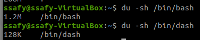

# Shell Script

- 목차
    - [CLI Shell 종류](#cli-shell-종류)
    - [Shell Script 개요](#shell-script-개요)

[들어가기 앞서]

- 빌드 프로세스
- 환경 설정
- 작업 자동화 스크립트

- crontab : 백그라운드에서 일정 시간마다 실행되는 관리자
    - 설정한 시간마다 정해진 백업 쉘 스크립트 실행
- 배포 방법
- 압축파일 관리
- source code 설치    

## CLI Shell 종류

우리가 기본적으로 쓰고 있는 쉘

- 우분투 기본 CLI Shell : **Bash**
    - 리눅스 사용자에게 가장 인기있는 CLI Shell

#### 현재 사용중인 쉘 확인
- `/etc/passwd` 파일에 기록되어 있음
- 사용자가 사용하는 CLI 쉘 이름 확인 가능

- CLI Shell으 여러가지가 존재함.
    `cat /etc/shells`

    - 쉘은 부팅하자마자 어떤 쉘로 실행될지 선택이 가능함

        e.g.

        - dash(데비안 암키스트 쉘) : 데쉬, 경량. 임베디드에서 주로 쓰이는 쉘

        - bash(본 어게인 쉘) : 배쉬,  기능이 많지만 무거움. 
        `리눅스 표준 쉘`

            - bash 쉘 스크립트가 대다수이다.

            - rbash : 제한된 bash 쉘

            - 펌웨어 : ST(가전)/르네상스(차량)

- 속도, 메모리 측면을 따져보며 shell을 선택해야 한다.

    -> `du -sh` 명령어를 사용하여 파일 용량 확인

    

[정리]

임베디드 리눅스 

- dash가 많이 사용됨.
- bash도 따로 설치해서 사용 가능

PC 리눅스
- bash를 주로 사용함

- [추가]

    - bash나 dash나 대부분의 shell 명령어는 똑같다.

## Shell Script 개요

[시작하기 전에]

- `alias`는 명령에 대한 별명을 만들어내는 명령어이다.(별칭)

    (e.g.)
    ```
    alias f1='mkdir ./bts;ls'
    alias f2='rm -r ./bts;ls'
    ```

- `ll`== `ls -al`

    - `ll`은 bashrc 파일에서 만든 alias이다.

    - `vi ~/.bashrc`로 alias를 확인해볼 수 있다.

[Quiz]

1. 파이썬의 스크립트 실행기는 ? 

    - ans : cpython, pypy

2. 자바스크립트의 스크립트 실행기는 ?

    - ans : node.js

3. bash shell script의 실행기는 ?

    - ans : bash