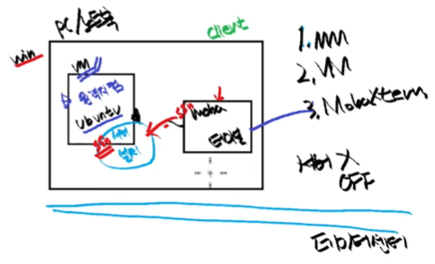

# Terminal

## 터미널의 이해

터미널 : 컴퓨터에 접속하기 위한 Text 기반 장치

S/W 터미널 : 컴퓨터 사용을 위한 단말기를 **S/W로 구현**함

- 현재는 CLI로 동작되는 프로그램을 `터미널` or `콘솔` 이라고 부른다.

#### 터미널 에뮬레이터 설치하기 : `$sudo apt install terminator -y`

- 보통 원격 접속인 경우 터미네이터 툴을 사용.

## 원격 접속의 두 가지 환경

[들어가기 전]

- 서버 : 다중접속 / 다중 사용자 환경을 지원

    -> 원격 접속 / 사용자(사용자를 생성 or 그룹 관리)를 관리하는 방법 / 파일 권한 관리

- 임베디드 : 특정한 목적대로 SW + HW 로 만들어진 시스템

### 1. <span style="color: red;">원격지컴퓨터</span>에 접속

- 집에서, 회사 컴퓨터로 원격접속하여 컴퓨터 제어 가능

- 원격지컴퓨터를 켜놓고 있어야 함 + 일부 설정 필요

1. GUI 기반

    - 라즈베리파이 프로젝트 시 사용(openCV) 

2. CLI 기반

    - <span style="color: red;">원격접속터미널</span> 프로그램을 사용하여 접속한다.

    - 자주 사용하는 이유 : 임베디드 리눅스에서 <span style="color: red;">GUI 원격 접속이 안되는 경우가 많다.</span>

        -> 임베디드 리눅스 : PC보다 저사양 장치에서 동작하는 경량 리눅스

        if 메모리 관리 good -> 비용 절감

#### 원격접속터미널 프로그램 준비

1. `mobaXterm`

- Portable edition : 설치 없이 사용 가능
- Installer edition : 설치 후 사용 가능

2. 프로그램 실행 후 다음을 입력

    - IP 주소
    - 우분투 ID
    - 우분투 PASSWORD

3. 추가 준비

    - **서버!** - <span style="color: red;">ssh 서버 프로그램 설치</span>

        - 요청을 받아서, 원하는 처리를 해 줌
        - 요청 받아 처리 후, 결과를 요청한 곳에 전달

    - 클라이언트 - mobaXterm에서 ssh 선택

        - 서버에게 요청하는 것

|클라이언트 프로그램|서버 프로그램|
|---|---|
|터미널 프로그램 = mobaXterm|클라이언트의 키보드 입력 -> 원격지 PC에 입력해주는 프로그램|
|키보드 입력을 서버에 전달|결과 화면을 클라이언트에 전달
    
- 설치하자마자 자동 실행된다.

- 리눅스에서는 백그라운드에서 실행되는 프로그램을 "시스템 데몬"이라고 함

    - 시스템 데몬 상태 방법 : `sudo systemctl status ssh`

        - systemctl : 시스템컨트롤
        - 눈에 보이지 않고 뒤에서 동작하는 프로그램이라 시스템컨트롤 명령어로 동작을 확인한다.
        - q 누르면 종료

## 원격 접속 프로토콜

#### 프로토콜 : 통신할 때의 규칙

### 프로토콜 특징 

```
A와 B가 통신하는데 

!서로 같은 프로토콜을 써야만 통신이 가능하다!
```

### 프로토콜 결정하기

원격 접속을 할 때,

서버쪽과 클라이언트가 `어떤 프로토콜로 통신할 지 결정`해야한다.

1. 쉘 접속용 프로토콜

    1. telnet : 암호화 안하는 프로토콜
        (보안이 약함)
    2. ssh : 암호화 하는 프로토콜

2. 파일 전송용 프로토콜

    1. FTP : 약어 = 파일, 전송, 프로토콜 = FTP
    2. SFTP : 시큐어 FTP        
        - 이미 설치됨

[시스템 데몬 상태 방법]

- ssh / sftp 데몬
    - `$sudo systemctl status ssh`

- telnet 데몬
    - `$sudo systemctl status inetd`

### 시스템 흐름 구성

