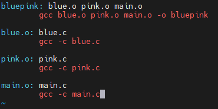
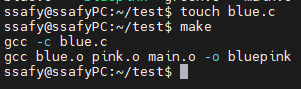
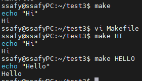
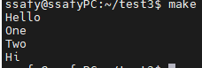
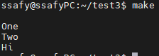

# gcc Build Process

### 빌드(Build)란 ?

: 소스코드에서 실행 가능한 Software로 변환하는 과정(process) 또는 결과물

## 빌드 프로세스

1. 전처리

2. 컴파일 & 어셈블

3. 컴파일(High-level language to low-level languagre)

4. 어셈블(assembler를 머신코드로 변환하는 과정)

5. 링킹(오브젝트 파일을 함수 라이브러리를 묶어서 합쳐주는 과정)

- 쉘 스크립트(권장 x)

- **Make 파일**

    - cmake : 메이크파일 자동 생성

#### c언어 빌드 과정(gcc 기준)

1. Compile & Assemble

    - 하나의 소스코드 파일이 0과 1로 구성된 Object 파일이 만들어짐

    - 각각의 c언어 파일을 컴파일(+Assemble)한다.

    - `gcc -c ./green.c` / `gcc -c ./yellow.c`

        - -c : Compile and Assemble

2. Linking

    - 만들어진 Object 파일들 + Library 들을 모아 하나로 합침

    - `gcc ./green.o ./yellow.o -o ./go`

        - -o : output 파일 지정

        - 여러 파일 지정이 가능하다.

    - 형식이 같은 여러 파일을 이러한 방식으로 링킹 할 수도 있음

        ```
        $gcc ./*.c
        
        $./a.out
        ```

## 빌드 자동화 스크립트

위에서 했던 컴파일 & 어셈블 + 링킹 과정에 필요한 스크립트를 자동화.


### 쉘스크립트(x)

#### build script 제작하기

```
vi build.sh

-- 내부에서 --
#! /bin/bash
gcc -c ./blue.c
gcc -c ./pink.c
gcc -c ./main.c
gcc ./main.o ./blue.o ./pink.o -o ./bluepink

rm -r ./*.o     // 불필요한 파일 제거

-- 실행 시 --
source build.sh
```

- 단점 

    - 링킹 한 파일들 중 하나의 파일을 수정하려 할 때,

    - <U>모든 파일을 다시 Compile & Assemble 함. </U>

-> 불필요한 컴파일 어셈블 과정이 진행된다.

- 프로그래밍 셋팅 & 환경설정 시에는 좋지만 **<U>Build를 위한 자동스크립트를 만들 때는 권장되지 않는다.**</U>

### Make File

: 쉘 스크립트의 단점을 해결 -> 코드 변경이 잦은 빌드 자동화 스크립트 작성에는 필수

- 불필요한 컴파일 어셈블을 피할 수 있다.

- 변경사항이 일어난 것만 빌드 시 적용됨.

<br>

## Build System

: Build 할 때 필요한 여러 작업을 도와주는 프로그램들

1. make

    `sudo apt install make -y`

2. cmake

### Build 자동화 스크립트 만드는 방법

1. bash shell script -> build 느리다.

2. python script -> build 느리다.

3. <U>make build system -> 빠르다.</U>

### make 사용 방법

1. "makefile" 이라는 스크립트 파일을 만든다.

    - make 문법에 맞추어서 작성
    - Bash Shell Script 문법과 다르다.

2. 스크립트를 만든 후 스크립트를 실행

    - 명령어 : `make`

#### 실습 준비하기

1. 기존 object 파일 삭제하기

2. makefile 작성

    - 파일명 : `Makefile`

    `vi Makefile`

### Make 파일 구조

- bluepink  : 실행 파일(target)

    - blue.o, pink.o, main.o : 의존성 파일(dependency), 전제조건

    - `gcc blue.o pink.o main.o -o bluepink` : 커맨드(command)

        - blue.c(`gcc -c blue.c`)

        - pink.c(`gcc -c pink.c`)

        - main.c(`gcc -c main.c`)

: 재귀적인 방식으로 해당 dependency들을 얻게 된다.



- 변경이 일어난 부분만 구조를 변경한다

    

[정리]

- 장점

    1. Build 자동화

        - 기술된 순서대로 Build 작업을 수행하는 자동화 스크립트 지원

    2. Build 속도 최적화

        - 불필요한 Compile & Assemble 피하기

    3. 과정을 보기(이해하기) 쉬움

## CMake

: make 파일 자동생성 tool

- build를 직접적으로 하는 도구가 아님.

CMake 설치 : `sudo apt install g++ cmake -y`

#### CMakeLists.txt 파일 작성

    - 정확히 위 파일명을 입력해야 한다.(대소문자 단.복수 주의)

    -> ADD_EXECUTABLE(생성파일이름 main.c blue.c pink.c) 입력

#### CMake 실행하기 : `cmake .`

-> !!! make 파일이 생성되는 것이지 make를 실행하는 것이 아니다 !!!

<br>

## make 스크립트

[실습]

```
// Makefile

HI:
        echo "Hi"

HELLO:
        echo "Hello"
```

결과:



#### Shell Script 명령어 @

- @ : 수행 할 명령어 입력을 생략하고, **결과만 출력**

    -> 두 번 출력을 막는다.(echo를 출력하지 않음.)

#### 의존성(dependency) 추가하기

- 수행 순서를 먼저 예측.

```
HI: one two
        @echo "Hi"

HELLO:
        @echo "Hello"

one: HELLO
        @echo "One"

two:
        @echo "Two"
```

실행 결과 : 



### 매크로

: Make 에서는 변수가 아닌 매크로이다. 하지만 같은 역할을 수행한다.

```
MSG1 = "One"
MSG2 = "Two"

HI: one two
        @echo "Hi"

HELLO:
        @echo ${asdasd}

one: HELLO
        @echo $(MSG1)

two:
        @echo ${MSG2}
```

실행 결과 : 



- 정의되지 않은 매크로는 빈칸으로 출력된다.

- 매크로는 글자 그대로 치환된다.

- 매크로는 아무 곳에 넣을 수 있다.

    - <U>however, 가독성을 위해 최상단에 적어주자.</U>

### echo 명령어 특징

- echo 명령어는 띄워쓰기를 1개만 허용

    ```
    echo "HI"       "ABC"
    
    결과 : HI ABC
    ```

    