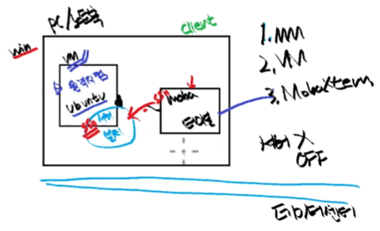
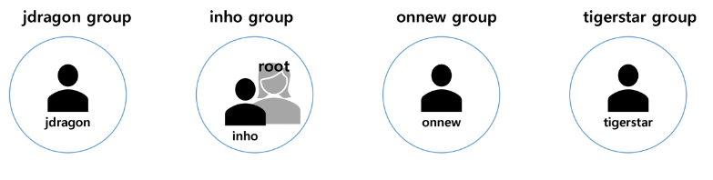
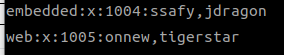
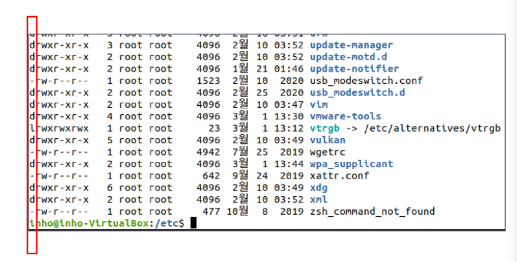
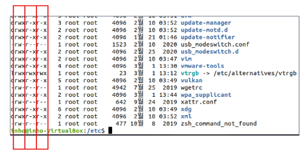
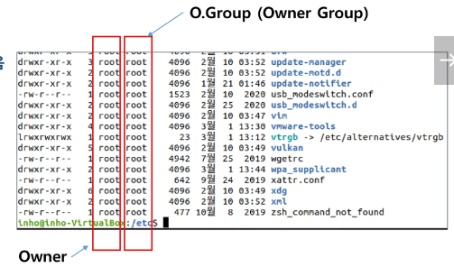

# Terminal

## 터미널의 이해

터미널 : 컴퓨터에 접속하기 위한 Text 기반 장치

S/W 터미널 : 컴퓨터 사용을 위한 단말기를 **S/W로 구현**함

- 현재는 CLI로 동작되는 프로그램을 `터미널` or `콘솔` 이라고 부른다.

#### 터미널 에뮬레이터 설치하기 : `$sudo apt install terminator -y`

- 보통 원격 접속인 경우 터미네이터 툴을 사용.

## 원격 접속의 두 가지 환경  

[들어가기 전]

- 서버 : 다중접속 / 다중 사용자 환경을 지원

    -> 원격 접속 / 사용자(사용자를 생성 or 그룹 관리)를 관리하는 방법 / 파일 권한 관리

- 임베디드 : 특정한 목적대로 SW + HW 로 만들어진 시스템

### 1. <span style="color: red;">원격지컴퓨터</span>에 접속

- 집에서, 회사 컴퓨터로 원격접속하여 컴퓨터 제어 가능

- 원격지컴퓨터를 켜놓고 있어야 함 + 일부 설정 필요

1. GUI 기반

    - 라즈베리파이 프로젝트 시 사용(openCV) 

2. CLI 기반

    - <span style="color: red;">원격접속터미널</span> 프로그램을 사용하여 접속한다.

    - 자주 사용하는 이유 : 임베디드 리눅스에서 <span style="color: red;">GUI 원격 접속이 안되는 경우가 많다.</span>

        -> 임베디드 리눅스 : PC보다 저사양 장치에서 동작하는 경량 리눅스

        if 메모리 관리 good -> 비용 절감

#### 원격접속터미널 프로그램 준비

1. `mobaXterm`

- Portable edition : 설치 없이 사용 가능
- Installer edition : 설치 후 사용 가능

2. 프로그램 실행 후 다음을 입력

    - IP 주소
    - 우분투 ID
    - 우분투 PASSWORD

3. 추가 준비

    - **서버!** - <span style="color: red;">ssh 서버 프로그램 설치</span>

        - 요청을 받아서, 원하는 처리를 해 줌
        - 요청 받아 처리 후, 결과를 요청한 곳에 전달

    - 클라이언트 - mobaXterm에서 ssh 선택

        - 서버에게 요청하는 것

|클라이언트 프로그램|서버 프로그램|
|---|---|
|터미널 프로그램 = mobaXterm|클라이언트의 키보드 입력 -> 원격지 PC에 입력해주는 프로그램|
|키보드 입력을 서버에 전달|결과 화면을 클라이언트에 전달
    
- 설치하자마자 자동 실행된다.

- 리눅스에서는 백그라운드에서 실행되는 프로그램을 "시스템 데몬"이라고 함

    - 시스템 데몬 상태 방법 : `sudo systemctl status ssh`

        - systemctl : 시스템컨트롤
        - 눈에 보이지 않고 뒤에서 동작하는 프로그램이라 시스템컨트롤 명령어로 동작을 확인한다.
        - q 누르면 종료

## 원격 접속 프로토콜

#### 프로토콜 : 통신할 때의 규칙

### 프로토콜 특징 

```
A와 B가 통신하는데 

!서로 같은 프로토콜을 써야만 통신이 가능하다!
```

### 프로토콜 결정하기

원격 접속을 할 때,

서버쪽과 클라이언트가 `어떤 프로토콜로 통신할 지 결정`해야한다.

1. 쉘 접속용 프로토콜

    1. telnet : 암호화 안하는 프로토콜
        (보안이 약함)
    2. ssh : 암호화 하는 프로토콜

2. 파일 전송용 프로토콜

    1. FTP : 약어 = 파일, 전송, 프로토콜 = FTP
    2. SFTP : 시큐어 FTP        
        - 이미 설치됨

[시스템 데몬 상태 방법]

- ssh / sftp 데몬
    - `$sudo systemctl status ssh`

- telnet 데몬
    - `$sudo systemctl status inetd`

### 시스템 흐름 구성



<br>

## 포트의 이해

### 포트 번호의 이해

어떤 신호가 들어왔을 때, 어떤 프로그램에게 도착한 신호인지 "!구분을 위한 번호!"

<U>IP 번호만 알아야 하는 것이 아니라 <span style='color: red;'>IP + 포트번호</span>까지 알아야 프로그램끼리 통신이 가능</U>

[자주 사용되는 포트 번호] - 국제관리기구에서 정한 포트 번호(권장사항)

1. 22번 포트

    - ssh, sftp 프로토콜을 쓸 때 자주 사용


2. 23번 포트

    - telnet 프로토콜을 쓸 떄 자주 사용

3. 80번 포트

    - http 프로토콜을 쓸 떄 자주 사용


### 포트포워딩

: <span style='color: red;'>가상 컴퓨터와 진짜 컴퓨터의 포트를 일치화 시켜주기</span>

- virtual box를 쓰기 때문에 포트포워딩으로 서로 포트를 연결해주어야 한다.

    - window -> cmd ipconfig
        
        네트워크상에서 ubuntu IP 주소 : 192.168.56.1

    - ubuntu -> terminator(터미널 프로그램) ifconfig 
        
    서로 IP 주소를 일치시켜주는 과정이 포트포워딩!

### 접속 테스트

- 쉘 접속 프로토콜

    - ssh

        - 모든 통신이 암호화되어, 감청 보안이 된다.
        - <span style='color: red;'>키 파일</span> 설정 필요

    - telnet

        - 보안성이 약하다.
        - <span style='color: red;'>별도 설정이 필요없다.</span>

- 파일 전송 프로토콜

    - sftp

<br>

## 텔넷 이야기

### 텔넷 프로토콜

Telnet

- Tel + Net : 통신 + 네트워크 프로토콜
- <span style="color: red;">원격지 컴퓨터를 CLI로 원격접속</span> 할 때 쓰임
- ASCII 코드를 사용한 통신

#### 임베디드에서 텔넷 : SSH

UART 라는 유선 Serial 통신으로 Shell을 사용한다.

- 네트워크에 연결이 불가능한 임베디드 장치

    - 유선 / 무선 랜 포트. 모뎀 칩이 보드 내에 존재하지 않는다. <span style="color: red;">SSH, 텔넷 사용 불가</span>

- 유선 연결을 통해 임베디드 보드 제어 / 개발 / 동작 Log 확인

#### 임베디드 장치 접속 후 제어 (임베디드 리눅스 사용시)

- 네트워크 접속이 가능한 임베디드 장치에서는 텔넷 / SSH 사용 가능
- 유선 없이 편리하게 개발 가능
- UART보다 훨신 빠름(유선 사용, 안정성)

<br>

## (다중)사용자와 파일권한 관리

### Host

: 네트워크에 연결되어 있는 <span style="color: red;">장치, 컴퓨터</span>


#### 리눅스는 다중 사용자 시스템으로 설계되었다.

- 한 컴퓨터를 여러 명이서 사용

#### 네트워크에 연결된 한 컴퓨터 개념으로 <span style="color: red;">리눅스가 설치된 컴퓨터 한 대를 Host라고 부른다.</span>

리눅스로 가능한 것

1. 나 혼자 사용

2. 전체가 쓰는 컴퓨터

    - 각자 계정으로 로그인 가능

#### However, 관리자 지정 필요.

- 공용 프로그램들 설치 / 제거를 모두에게 허용할 수는 없음

- 해당 pc의 모든 권한을 관리한다는 의미.

#### 공용 프로그램 관리

- 관리자(root)만 건드리도록
- root 계정이 있어, root 계정이 프로그램 추가 / 삭제 가능
    - 실질적인 권한 소유
- root 계정은 모든 User 권한을 다 확인할 수 있다.

-> root로 아무나 접속하지 못하도록 보안에 신경써야한다.

[정리]

Host : 컴퓨터
User 계정 : 개인
관리자(root) : admin

### Host 세팅

- 원격접속으로 진행

```
Host : 네트워크에 연결된 장치

Host name : 장치를 지목할 때 쓰는 이름
    - 네트워크의 특정 PC를 지목하는 방법 1 : ip 주소
    - 네트워크의 특정 PC를 지목하는 방법 2 : hostname(localhost)
```

- host name / user name 구분하기
    
    `username@host-pc`

1. Host name 변경

    `sudo vi /etc/hostname` -> 변경 후 저장(`:wq`)

2. ping test

    `ping 'host name'`

3. root 로그인

    - 우분투는 root 로그인 불가능

        - 보안상 이유
        - 설정을 바꿔 해결할 수 있다.

    <span style="color: red;">먼저 일반 계정</span>으로 접속한 뒤,

    -> <span style="color: red;">사용자 변경을 통해 root 계정 사용 가능</span>

    1. `sudo su` 입력 : 사용자 변경
    2. exit 입력 : root를 빠져나와서, 다시 원래 user로 돌아온다.

- 아무나 root로 변경 가능한 것이 아니다.

- root 변신 권한이 아닌 "root 권한을 가진 계정"이라고 표현한다.

### `sudo`

: 관리자의 힘으로 해당 명령어를 수행한다. 라는 의미
: <span style="color: red;">root 권한으로 명령어 수행</span>

#### Android 레벨이 아닌 이상, 사용자는 대부분 필요없다.

#### 임베디드 리눅스에서는 켜자마자 root 권한으로 자동 App 실행되게 동작.

<br>

## 시간 세팅

: 로그 메세지에 정확한 시간을 찍기 위함 

-> 디버깅 할 때 필수적으로 분석해야 하는 정보에서 시간 정보가 매우 중요함.

### `rdate` 설치 

: `sudo apt install rdate`

`sudo rdate time.bora.net` : LG 유플러스가 운영하는 시간 서버

프로그램이 하는 일

1. 시간 정보를 가지고 있는 Time Server 서버 접속
2. Time Server에서 시간 정보를 가져온다.
3. 내 Host에 Time 값을 적용한다.

<br>

## User 만들기

1. 해당 user 이름으로 로그인이 가능한 <span style="color: red;">root 권한이 없는</span> 새로운 계정이 생성된다.

2. 해당 경로에 user 전용 디렉토리가 만들어진다.

    `/home/[user 이름]

#### `sudo adduser 'username'`

- 동사가 먼저 나오고, 명사가 나온다. 
- useradd가 아님. 착각 주의

|adduser|useradd|
|---|---|
|필요한 모든 설정들을 Default 값으로 생성|홈 디렉토리, 계정 설정, 사용자 UID 설정, 시작 쉘 환경 등 세부 설정 가능|

#### 현재 사용자에서 잠시 다른 사용자로 이동하기

`su [user 계정이름]`

탈출하기 : `exit`

### User 정보 삭제

1. root 접속 : `sudo su`
2. `deluser [삭제할 user 이름] --remove-all-files`

<br>

## Group 만들기

### 중요! 유저 계정을 하나 만들면, 자동으로 그룹도 하나 만들어진다.

ex) inho 계정 adduser 시, inho 라는 그룹도 만들어진다.



### 특정 user가 소속된 그룹 확인하기

`groups [user 이름]`

### group 생성하기

`sudo addgroup [그룹 이름]`

#### 만든 그룹에 user 추가 / 삭제

추가 : `sudo gpasswd -a [user 이름] [추가할 group 이름]`

- `-a` : add

삭제 : `sudo gpasswd -d [user 이름] [추가할 group 이름]`

- `-d` : delete

- group에 잘 들어갔는지 확인

    `cat /etc/group`

    

    여기서 jdragon은 2개 그룹에 소속되어 있다.

    1. jdragon 그룹 안에 jdragon
    2. embedded 그룹 안에 jdragon

#### <span style="color: red;">한 user는 여러 개의 그룹에 참여 가능하다.</span>

### Group을 쓰는 이유

- Group 단위로 권한을 단체 설정하기 위함.

    - 그룹 별로 하는 역할이 다름

- 실제 회사에서도 이런 방식으로 부서별 그룹을 지정

### Group 삭제

`delgroup [그룹명]`

<br>

## 권한 세팅

### 사전학습 : 리눅스 파일의 종류

1. 폴더 / 디렉토리 아무렇게 불러도 상관 없다.
2. 폴더도, 일반 파일도 모두 파일로 취급한다.
    - 리눅스 커널 내부에서는, 파일과 폴더를 똑같이 취급

#### 파일의 4가지 종류

1. Regular File(`-`)

    - 일반 파일

2. Directory File(`d`)

    - 리눅스 커널 내부에서는, 디렉토리도 파일로 취급

3. Link File(`l`)

    - 윈도우의 <span style="color: red;">바로가기</span>와 비슷한 파일

4. Device File(`c`, `b`)

    - 새로운 장치(마우스 등) 연결하면, <span style="color: red;">상징물</span>과 같은 파일이 하나 생긴다. 
    - 이 파일을 건드리면, 장치를 제어할 수 있음.

### `ls -al` 권한 표시

#### 파일의 종류



#### `r`, `w`, `x`

- `r` : 파일 read 권한

- `w` : 파일 write 권한

- `x` : 파일 실행(execution) 권한



- 앞 블록 : Owner의 권한

- 중간 블록 : Owner Group의 권한

- 마지막 블록 : <span style="color: red;">Owner / Owner Group을 제외한 사람들</span>의 권한

#### 파일의 user와 group

- 한 파일을 누가 사용하고 <span style="color: red;">어느 그룹이 사용</span>하는지가 명시됨



### <span style="color: red;">Owner는 Owner Group에 소속되지 않아도 된다.</span>

<br>

## 권한 설정 바꾸기

[유의사항]

- Linux 원격접속하여 실습 진행

### 작업폴더 work

[순서]

```
mkdir ~/work
cd work
ls
touch abc.txt
ls -al
```

### Owner 변경

#### Owner User와 Group 변경하기

- 명령어 : `chown` - change owner
- `chwon [User이름]:[group이름] [파일명]
- 관리자 권한으로 실행

### 파일 Mode 변경

- user, group, other 들의 권한을 File Mode 라고 부른다.

`sudo chmod [변경할 mode] 파일명`

1. user를 rwx로 바꾸기
    - ex) `sudo chmod u=rwx ./aaa`
2. group을 rw-로 바꾸기
    - ex) `sudo chmod g=rw ./bbb`
3. other를 r-x로 바꾸기
    - ex) `sudo chmod o=rx ./ccc`

<br>

## 실행 파일 권한

### 텍스트 파일 권한

- 텍스트 파일을 실행하면 쉘스크립트로 동작한다.

1. /test.txt 파일 생성 후, 아래 내용을 넣는다.
2. chmod <span style="color: red;">u=rx</span> 권한 설정
    - 한 줄 씩 읽으며 실행하기에 Read, Excute 둘 다 지정해야함
3. 텍스트 파일 실행하기
    - ./test.txt

### 디렉토리 파일 권한

- 디렉토리 권한이 execution 권한 ? cd로 폴더 접근할 수 있는 권한
- 디렉토리 권한이 read 권한 ? ls로 파일 목록을 읽을 수 있는 권한

[참고]

- 파일 복사를 위한 권한 두 가지

    1. 복사할 파일의 Read 권한
    2. 복사 도착지 디렉토리에 대한 Write 권한
    