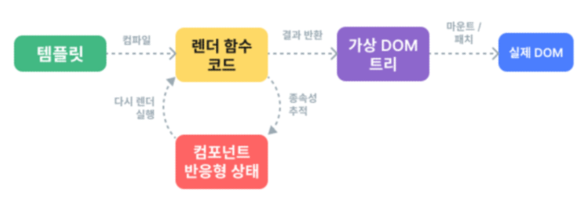

# Single File Components

- [Single-File Components](#Single-File-Components)

- [SFC build tool(Vite)](#SFC-build-tool(Vite))

- [Vue Component](#Vue-Component)

- [추가 주제](#추가-주제)

## Single-File Components

### Component : 재사용 가능한 코드 블록

- UI를 독립적이고 재사용 가능한 일부분으로 분할하고 각 부분을 개별적으로 다룰 수 있음

- 앱은 자연스럽게 중첩된 Component의 트리로 구성됨

### SFC(Single-File Components)

: 컴포넌트의 템플릿, 로직 및 스타일을 하나의 파일로 묶어낸 특수한 파일 형식(*.vue 파일)

- SFC 구성 요소

    `vbase-3-setup`

    - 각 *.vue 파일은 세 가지 유형의 최상위 언어 블록

        - `<template>, <script>, <style>` 으로 구성됨

        - 언어 블록의 작성 순서는 상관 없으나 일반적으로 template -> script -> style 순서로 작성

        1. `<template>`

            - 각 *.vue 파일은 최상위 `<template>`블록을 하나만 포함할 수 있음

        2. `<script setup>`

            - 각 *.vue 파일은 하나의 `<script setup>` 블록만 포함할 수 있음(일반 script 제외)
            - 컴포넌트의 setup() 함수로 사용되며 컴포넌트의 각 인스턴스에 대해 실행

        3. `<style scope>`
            
            - *.vue 파일에는 여러 style 태그가 포함될 수 있음

            - scoped가 지정되면 CSS는 현재 컴포넌트에만 적용

 

## SFC build tool(Vite)

: 프론트엔드 개발 도구

-> 빠른 개발 환경을 위한 빌드 도구와 개발 서버를 제공

### NPM(Node Package Manager)

: Node.js의 기본 패키지 관리자

-> Chrome의 V8 JS 엔진을 기반으로 하는 Server-Side 실행 환경

### Vite 프로젝트 구조

#### `node_modules`

- Node.js 프로젝트에서 사용되는 외부 패키지들이 저장되는 디렉토리
- 프로젝트의 의존성 모듈을 저장하고 관리하는 공간
- 프로젝트가 실행될 때 필요한 라이브러리와 패키지들을 포함
- .gitignore에 작성됨

#### `package-lock.json`

- 패키지들의 실제 설치 버전, 의존성 관계, 하위 패키지 등을 포함하여 패키지 설치에 필요한 모든 정보를 포함
- 패키지들의 정확한 버전을 보장하여 여러 개발자가 협업하거나 서버 환경에서 일관성 있는 의존성을 유지하는 데 도움을 줌

#### `package.json`

- 프로젝트의 메타 정보와 의존성 패키지 목록을 포함
- 프로젝트의 이름, 버전, 작성자, 라이선스 등과 같은 메타 정보를 정의

-> package-lock.json과 함께 프로젝트의 의존성을 관리하고, 버전 충돌 및 일관성을 유지하는 역할

#### `public 디렉토리`

- 주로 다음 정적 파일을 위치 시킴

    - 소스코드에서 참조되지 않는
    - 항상 같은 이름을 갖는
    - import 할 필요 없는

- 항상 root 절대 경로를 사용하여 참조

    - public/icon.png는 소스 코드에서 /icon.png로 참조할 수 있음

#### `src 디렉토리`

- 프로젝트의 주요 소스 코드를 포함하는 곳
- 컴포넌트, 스타일, 라우팅 등 프로젝트의 핵심 코드를 관리

    - `src/assets`

        - 프로젝트 내에서 사용되는 자원(이미지, 폰트, 스타일 시트 등)을 관리
        - 컴포넌트 자체에서 참조하는 내부 파일을 저장하는데 사용
        - 컴포넌트가 아닌 곳에서는 public 디렉토리에 위치한 파일을 사용

    - `src/components`

        - Vue 컴포넌트들을 작성하는 곳

    - `src/App.vue`

        - Vue 앱의 최상위 Root 컴포넌트
        - 다른 하위 컴포넌트들을 포함
        - 애플리케이션 전체의 레이아웃과 공통적인 요소를 정의
    
    - `src/main.js`

        - Vue 인스턴스를 생성하고, 애플리케이션을 초기화하는 역할
        - 필요한 라이브러리을 import하고 전역 설정을 수행

#### `index.html`

- Vue 앱의 기본 HTML 파일
- 앱의 진입점
- Root 컴포넌트인 App.vue가 해당 페이지에 마운트(mount) 됨

    -> vue 앱이 SPA 인 이유

- 필요한 스타일 시트, 스크립트 등의 외부 리소스를 로드할 수 있음

### 모듈과 번들러

#### Module : 프로그램을 구성하는 독립적인 코드 블록(*.js 파일)

- 자연스럽게 파일을 여러 개로 분리하여 관리를 하고, 분리된 각각의 파일을 module

#### Bundler : 여러 모듈과 파일을 하나(혹은 여러 개)의 번들로 묶어 최적화하여 애플리케이션에서 사용할 수 있게 만들어주는 도구

- 의존성 관리, 코드 최적화, 리소스 관리 등
- Bundler가 하는 작업을 Building이라 함

 

## Vue Component

컴포넌트 사용 2단계

1. 컴포넌트 파일 생성
2. 컴포넌트 등록(import)

[실습 진행]

 

## Virtual DOM

- 가상의 DOM을 메모리에 저장하고 실제 DOM과 동기화하는 프로그래밍 개념

- 실제 DOM과의 변경 사항 비교를 통해 변경된 부분만 실제 DOM에 적용하는 방식

- 웹 애플리케이션의 성능을 향상시키기 위한 Vue의 렌더링 기술

    

### 장점

- 효율성

    - 실제 DOM 조작을 취소화하고, 변경된 부분만 업데이트하여 성능을 향상

- 반응성

    - 데이터의 변경을 감지하고, Virtual DOM을 효율적으로 갱신하여 UI를 자동으로 업데이트

- 추상화

    - 개발자는 실제 DOM 조작을 Vue에게 맡기고 컴포넌트와 템플릿을 활용하는 추상화된 프로그래밍 방식으로 원하는 UI 구조를 구성하고 관리할 수 있음

### 주의사항

- 실제 DOM에 직접 접근하지 말 것

    - JS에서 사용하는 DOM 접근 관련 메서드 사용 금지
    - `querySelector, createElement, addEventListener 등`

    -> Vue의 ref와 Lifecycle Hooks 함수를 사용해 간접적으로 접근하여 조작할 것

### Composition API & Option API

#### Composition API

- import 해서 가져온 API 함수들을 사용하여 컴포넌트의 로직을 정의

- Vue3 에서의 권장 방식

#### Option API

- data, methods 및 mounted 같은 객체를 사용하여 컴포넌트의 로직을 정의

- Vue2 에서의 작성 방식