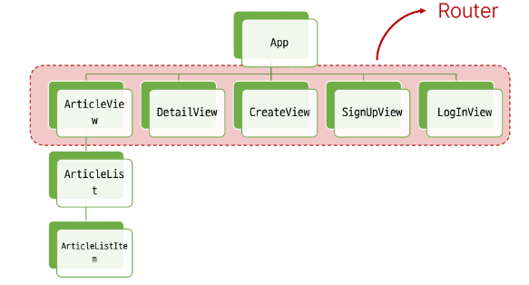
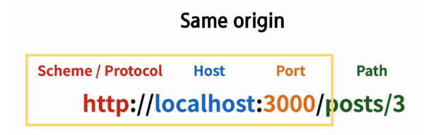

# Vue with DRF 1

- [프로젝트 개요](#프로젝트-개요)

- [메인 페이지 구현](#메인-페이지-구현)

- [CORS Policy](#CORS-Policy)

- [Article CR 구현](#Article-CR-구현)

<br>

## 프로젝트 개요

- 스켈레톤 프로젝트 django-pjt 제공

- 외부 패키지 및 라이브러리는 requirements.txt에 작성되어 있음

- DRF 프로젝트는 주석을 해제하며 진행

- vue project는 Pinia 및 vue router가 추가되어있음

- pinia-plugin-persistedstate 설치 및 등록됨

- django, vue 각각 개별 터미널 사용



<br>

## 메인 페이지 구현

- front / back 프레임워크 간의 요청과 응답, 그 과정에서 등장하는 새로운 개념과 문제를 해결하며 하나의 서비스를 구현

- 게시글 작성 / 조회

### state 참조 및 출력

### state with DRF

- DRF 서버에 직접 요청하여 데이터를 응답받아 store에 저장 후 출력하기

- DRF 서버로부터 AJAX 요청을 통해 데이터를 받아온다.

1. DRF 서버로의 AJAX 요청을 위한 axios 설치 및 관련 코드 작성

2. DRF 서버로 요청을 보내고 응답 데이터를 처리하는 getArticle 함수 작성

    - axios로 구성

3. ArticldView 컴포넌트가 마운트 될 때 getArticles 함수가 실행되도록 함

    -> 해당 컴포넌트가 렌더링 될 때 항상 최신 게시글 목록을 불러오기 위함

#### However, 응답은 무사히 했지만 브라우저 측에서 거절함

: XMLHttpRequest에 대한 접근이 CORS policy에 의해 차단

<br>

## CORS Policy

### CORS

#### SOP : 동일 출처 정책

- 어떤 출처(Origin)에서 불러온 문서나 스크립트가 다른 출처에서 가져온 리소스와 상호 작용하는 것을 제한하는 보안 방식

-> 웹 애플리케이션의 도메인이 다른 도메인의 리소스에 접근하는 것을 제어하여 사용자의 개인 정보와 데이터의 보안을 보호하고, 잠재적인 보안 위협을 방지

-> 잠재적으로 해로울 수 있는 문서를 분리함으로써 공격받을 수 있는 경로를 줄임

#### Origin (출처)

- URL의 Protocol, Host, Port를 모두 포함

`아래 세 영역이 일치하는 경우에만 동일 출처(Same-origin)로 인정`



- ex) http://localhost:3000/articles/3/ 기준으로 동일 출처 여부를 비교

|URL|결과|이유|
|:---:|:---:|:---:|
|http://localhost:3000/articles/|성공|path만 다름|
|http://localhost:3000/comments/3/|성공|path만 다름|
|https://localhost:3000/articles/3/|실패|protocol이 다름|
|http://localhost:80/articles/3/|실패|port가 다름|
|https://domain:3000/articles/3/|실패|Host가 다름|

### CORS policy의 등장

- 기본적으로 웹 브라우저는 같은 출처에서만 요청하는 것을 허용하며, 다른 출처로의 요청은 보안상의 이유로 차단됨

    - SOP에 의해 다른 출처의 리소스와 상호작용 하는 것이 기본적으로 제한되기 때문

-> <U>CORS</U>는 웹 서버가 리소스에 대한 서로 다른 출처 간 접근을 허용하도록 선택할 수 있는 기능을 제공

### CORS

: 교차 출처 리소스 공유

- 특정 출처(Origin)에서 실행 중인 웹 애플리케이션이 <span style="color: red;">다른 출처의 자원에 접근할 수 있는 권한을 부여</span>하도록 브라우저에 알려주는 체제

-> 만약 다른 출처의 리소스를 가져오기 위해서는 이를 제공하는 서버가 브라우저에게 다른 출처지만 접근해도 된다는 사실을 알려야 함

#### "CORS policy(교차 출처 리소스 공유 정책)"

- 다른 출처에서 온 리소스를 공유하는 것에 대한 정책

- 서버에서 설정되며, 브라우저가 해당 정책을 확인하여 요청이 허용되는지 여부를 결정

- 다른 출처의 리소스를 불러오려면 그 출처에서 올바른 <span style="color: red;">CORS header를 포함한 응답을 반환</span>해야 함


#### django 에서 설치 : 

```python
pip install django-cors-headers

# settings.py
INSTALLED_APPS = [
    ...
    'corsheaders',
]

# 방화벽
MIDDLEWARE = [
    ...
    'corsheaders.middleware.CorsMiddleware',
    'django.middleware.common.CommonMiddleware',
]

# CORS를 허용할 Vue 프로젝트의 Domain 등록
CORS_ALLOWED_ORIGINS = [
    'http://127.0.0.1:5173',
    'http://localhost:5173',
]
```

<br>

## Article CR 구현

- 단일 게시글 조회 및 생성