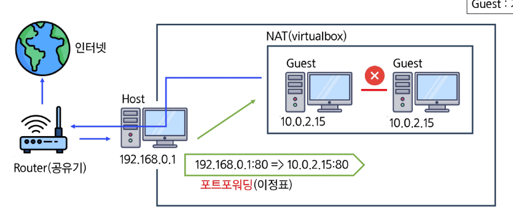
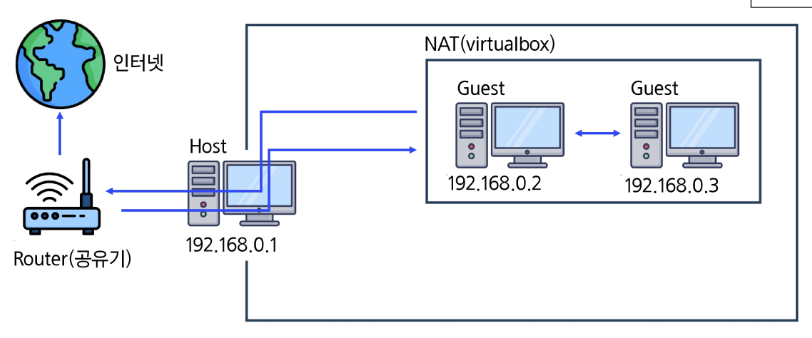
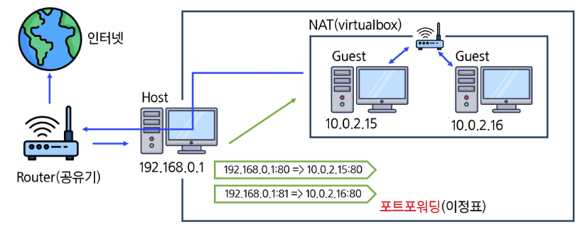
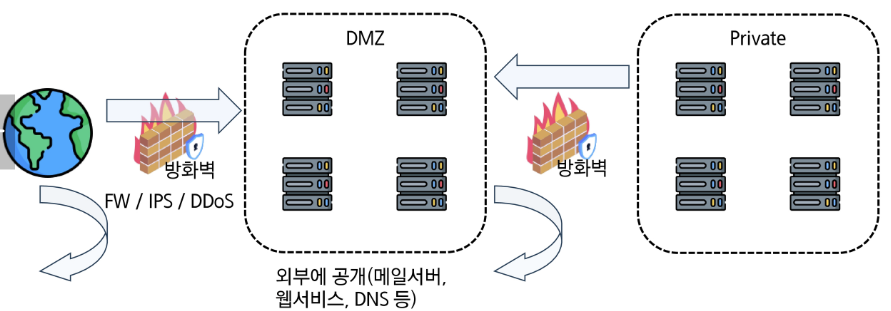
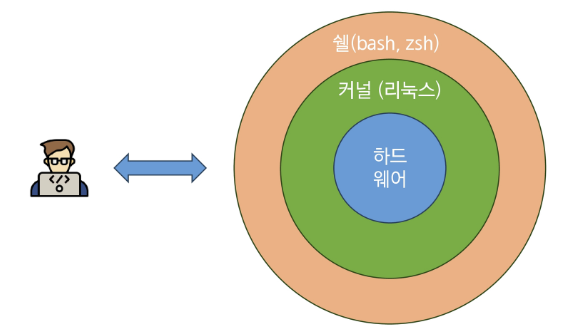

# Server Management

- [서버관리와 리눅스](#서버관리와-리눅스)

- [서버관리와 네트워크](#서버관리와-네트워크)

- [Public & Private Networ](#Public-&-Private-Networ)

- [AWS](#AWS)

- [베포 실습](#베포-실습)
 
 

## 서버관리와 리눅스

### 리눅스 사용 이유 ?

1. Free and Open Source : 자유로움 & 오픈소스 라이브러리

2. Stability : 안정성

3. Secure and Flexibility : 보안 및 유연

여러가지 리눅

- 슬랙웨어

- 데비안

    - 우분투

- 레드햇

    - 페도라

    - centOS

## 서버관리와 네트워크

### NAT(Network Address Translation / 네트워크 주소 변환)

- 내부 네트워크에서 외부 네트워크로 단방향 연결, host 내부 네트워크와 통신 불가

- 호스트(실제 컴퓨터)와 내부 게스트(가상 머신)간 통신을 하려면 포트포워딩 필요.

- 가상 머신들끼리 통신 불가

    

### 어댑터에 브리지

- 외부 라우터에서 IP 주소 직접 받아옴

    

### NAT Network

- NAT 방식과 비슷하지만 내부 네트워크의 게스트간 통신이 가능

- DHCP에 의해 IP address를 자동으로 할당 받음

    - DHCP : TCP/IP 통신을 실행하기 위해 필요한 ip를 자동적으로 할당. 관리하기 위한 통신 규약(프로토콜)

### 호스트 전용 어댑터

- 호스트와 게스트간 통신은 되지만 외부 인터넷은 안됨

### 내부 네트워크

- 게스트간 통신만 가능

- 호스트와 게스트간 통신 불가능. 인터넷도 안됨

 

## Public & Private Networ

: 네트워크 망이 외부에 공개되거나 내부에서만 사용

- DMZ(Demilitarized Zone)

    

### Linux shell & CLI command

#### shell

- 운영체제와 사용자를 이어주는 시스템 프로그램

- 사용자의 명령어를 해석하는 인터프리터

#### CLI 기본 명령어

- touch : 파일 만들기(날짜와 시간 수정)

- cat : 파일 내용 보기

    - -e 옵션 : 줄 끝에 $ 보여주기
    - -n 옵션 : 줄 번호 보여주기

- rm : 파일 삭제

    - -r 옵션 : 디렉토리 삭제(recursive)

- mkdir : 디렉토리 만들기

- rmdir : 디렉토리 삭제

- cp : 파일 복사

    - cp 복사할파일이름 결과파일이름

- mv : 파일 이동

    - mv 이동할파일이름 목표위치

- ls : 현재 디렉토리 내 파일 리스트

    - -a 옵션 : 모두 보기(숨김 파일)
    - -l 옵션 : 길게 설명
    - -al 옵션 : 길게 모두 보기

#### CLI 자주 사용하는 명령어

- sudo(superuser do) : 루트 권한으로 실행

- apt / apt-get : Debian 기반 리눅스 패키지 관리자 도구

- clear : 터미널 화면 비우기 명령

- ssh : secure shell

[추가] 프로토콜 : 절차를 포함한 통신 규약

 

## AWS(Amazon Web Service)

서비스 -> EC2

- region : 어느 지역의 인스턴스를 빌릴 지 체크

- Futty Key Generator : pem 형식의 키를 ppk 형식으로 변환해주는 앱

!!! Futty든 PowerShell이든 키가 있어야지 서버 접속이 가능하다. 

-> 위 쉘에서 진행하는 과정들을 편하게 해주기 위해 FileZilla를 사용하자. 

마찬가지로 ip주소, 사용자이름, ppk 키를 입력해주면 접근이 가능하다.